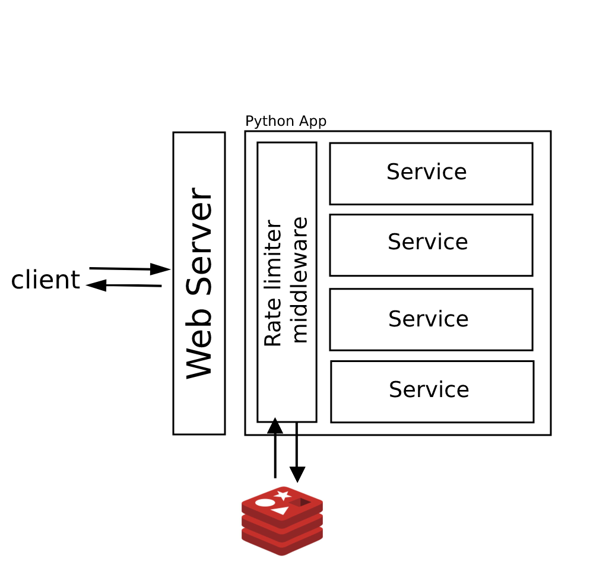
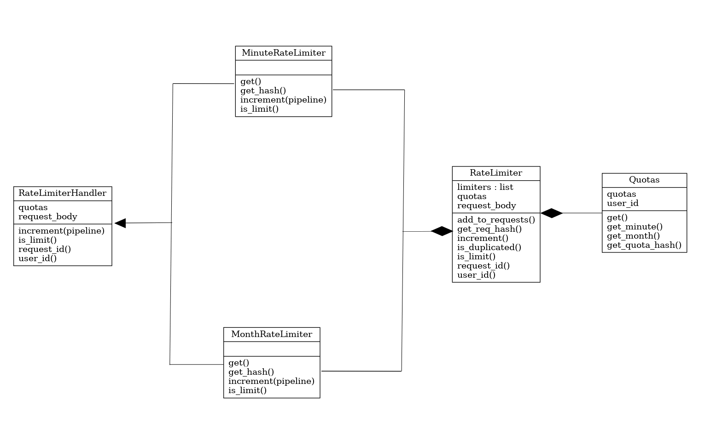
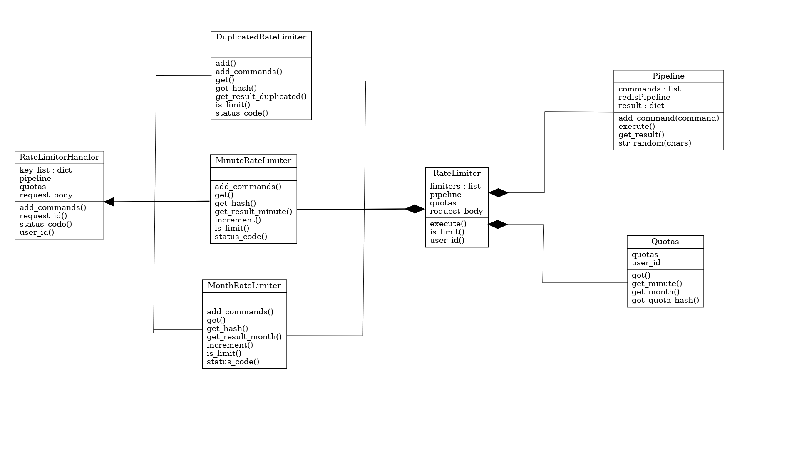

## ساختار
برای اجرای rate limiter از redis استفاده شده redis قابلیت های زیادی رو در اختیار ما میگذارد برای محدود کردن تعداد ریکویست های ماهیانه یک شمارنده با کلید ماهی که توش هستیم گذاشتم و زمان اکسپایر اخر همین ماه براش ست کردم و برای محدود کردن تعداد ریکویست ها در دقیقه کلیدی برای دقیقه براش ست کردم که یک دقیقه هم اکسپایر تایم داره

برای پیدا کردن ریکویست های تکراری هم از قابلیت redis استفاده شده به نام bloom filter.
این فیلتر یک ساختمان داده احتمالی است به این معنی که مانند set کلید هایی رو در خود نگهداری میکند و بعد برای بررسی این ایتم قبلا در این ساختار حضور داشته یا نه میتوان ازش استفاده کرد با این تفاوت که اگر ایتم مورد نظر وجود نداشته باشد قطعا جواب این فیلتر false است ولی ممکن است در جواب وجود دارد با احتمال خیلی اندک اشتباه بکند و بگوید وجود دارد. تفاوتی مهم دیگری که نسبت به set دارد این است که اندازه حافظه ای که استفاده میکند محدود است و برای اجرای حجم زیاد رکویست عملکرد بهتری نسبت به set از خود نشان میدهد چرا که تعداد کم خطا را میتوان چشم پوشی کرد ولی حجم استفاده شده از حافظه را خیر.

